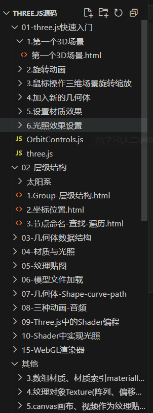
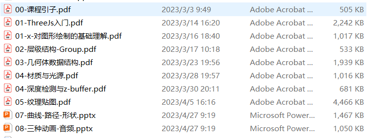

# three.js_study_tutorials
这是我学习three.js中所使用的教程，以及自己学习过程中开发的小实验，这些都会帮助大家学习。

课程中所使用的源代码在源代码文件夹中。

在这个仓库中，还包含个人学习时所开发的实验，也就是一些小的项目。但其中src中的three.js库已经失效。

可以采用最新的three.js库运行代码。

three.js源码库我放到了three.js-dev以及threejs这两个文件夹当中，如果src中的库已经失效，可以直接调用本地端的库。

在每个实验的文件夹中，也有对应介绍项目的具体说明文档。

### 相关资源

three.js学习链接：http://www.webgl3d.cn/

好玩的three.js项目推荐：https://juejin.cn/post/7267158769489608744

学习源代码：其中有系统性的教程级别的three.js文件。

ppt：

如果有需要ppt或者是学习源码的可以通过邮箱联系我。邮箱：jordanpeking6@gmail.com
